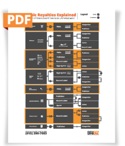

## Download a free info-graphic explaining how royalties are distributed!

With each passing year, new digital services emerge, paying fractions of a cent for each listen. It’s no wonder that making money in the music industry has long been called “a river of nickels”…sometimes, maybe even pennies.

You’ve poured your heart and soul into your song, crafting each lyric, each note. You head to the studio, recording and perfecting your song. If you’re signed to a label, you submit the masters to your team and, before long, you’re on your way to a public release. It’s out in the world, and … what happens next? Where does your mailbox money come from? Who collects it and why?

There are a few factors that will either limit or multiply your income from royalties. In this blog post and accompanying infographic, I’ll try to help you get a grip on the factors that drive royalties, where the money comes from, and how it gets to you. But first, let’s explain the most basic piece: the two basic ways that recorded music is monetized.

While the payments themselves can get complicated, there are basically two types of copyright: the Composition (the “song”, regardless of who records it–typically a split between songwriters and publishers) and the Master (the recording, often owned by a label or indie artist).

### **Factor 1: The Composition Copyright**

So, let’s start with the **Composition**. This is often what we think of as *the song itself*–the lyrics, the music, the score, and depending on the era, the arrangement. Anyone who wants to use, record, or perform the song has to get permission from whoever owns the copyright to the composition–whether that’s a publisher (an organization or individual who administers the copyright and payments for songs, which they will often promote), or a songwriter.

The portion paid for the composition on recordings is known as the Mechanical Royalty. It may seem like a bizarre word choice, but this is exactly why there has been such a huge debate around music payments: even our terminology dates back a very long time. The first physical recordings of songs that were distributed were on piano rolls, used in saloons and bars all over the world. So, *Mechanical Royalties* first referred to the creation of mechanical piano rolls, but it has generally come to refer to any time that a composition is applied to a recorded medium (other than sheet music).

### **Factor 2: The Sound Recording Copyright**

The second copyright is paid for the sound recording, often referred to as **The Master.** This refers to a particular *recording of the song* and the data (tapes, files) that go with it. As an indie artist, the same person may own both Master and Composition Copyright. But often, the Master is owned by the record label (depending on your contract), or the recording artist. The Publisher owns and receives payments for the song, but the label owns and collects for the Master.

So, there are basically only two “people”, collecting payments – but how they get paid in the first place is where things start to get a little complicated. Let’s simplify it for you.

### **Factor 3: Performance**

You flip through the radio stations in the car, and all of a sudden, there it is… your song! But in terms of royalties, would this be the same as if you’d heard it on SiriusXM? You’re in the same car, flipping a simple button on your dashboard, but this simple context shift changes not only your royalties but also how you’ll collect those royalties–if you’re in the U.S. this difference is significant.

The first performance venue to consider is called a **Public Performance**. While a little confusing, this refers to a public “performance” *of a recording* and includes any time a *recording* of your song is played on radio stations, at businesses, restaurants, concert venues, bars, nightclubs, sports arenas, bowling alleys, shopping malls…well, you get the picture.

In these cases, you would collect public performance royalties through a PRO, or public performance organization. These include: ASCAP (American Society of Composers, Authors, and Publishers), BMI (Broadcast Music, Inc.), and SESAC (Society of European Stage Authors and Composers). In terms of what royalties are collected, these venues favor the Composition Copyright owners—those who wrote the song or work on their behalf. In fact, in the United States, there is no obligation for these mediums–including broadcast radio–to pay the owners of the Masters at all.

Through the wonders of technology, we’ve opened another performance venue: **Digital Public Performances**. Royalties collected from digital public performances often come through a specific PRO, SoundExchange, and include (but aren’t limited to) music streaming over satellite radio (SiriusXM), the internet (Pandora, Rhapsody), and cable (Music Choice, Verve). Some digital streaming “venues” (like Spotify and Apple Music) bypass SoundExchange, however, as they’ve struck up their own deals with labels to pay royalties directly to PROs, Publishers, and whoever owns the Masters. Presently, royalties from digital public performances favor the Master—those who own the recording, most likely record labels and recording artists.

We’ve created a helpful chart to help you follow the flow of royalties. In the left column, you find the performance venue or marketplace. From there, the center column will show you who collects the payments on behalf of which parties–Master or Composition. Then, the right column shows who will get paid (happy day!). For example, a song plays on SiriusXM; royalties are collected by SoundExchange on behalf of whoever owns the Master; SoundExchange then pays the royalties to recording artist and label.

In addition to these more traditional venues, there’s a third option: **Sync Licensing**. Sync licensing refers to anytime you grant permission for your music to be used in an audiovisual presentation, like a movie, TV show, commercial, or video game. This option has the possibility of earning a tremendous amount of income through one-time fees and ongoing royalties. First, an initial sync license fee (a one-time sum paid upfront) is distributed to both the songwriter and the recording artist. Then, depending on your contract with the buyer, once the presentation starts getting “performed live” (like when the commercial plays on TV or when the movie hits theaters), you start earning those performance royalties we looked at above.

There are several benefits to sync licensing. As it’s relatively recent (compared to the Piano rolls of yesteryear) Sync is an opportunity built for the modern age: songwriters and artists are paid nearly 50/50, and it is far less dependent on popular trends or radio, being focused on the emotion the moment evokes. Also, since the music is being chosen for the viewers, you have a built-in audience–people who haven’t heard of you now have increased exposure to your music. The use of your music in an audiovisual project also has the potential to generate passive income, or revive a song that’s been out for several years. Finally, as you get to [negotiate your contract](https://www.digitalmusicnews.com/2015/05/25/a-simple-guide-to-signing-the-best-sync-deal-possible/), you have more freedom as you consider your immediate and long-term financial goals.

So, when it comes time for mailbox money, you’ll see revenues from BOTH a public performance PRO (like ASCAP) and SoundExchange, along with those few venues who’ve bypassed PROs altogether–these will be paid to whoever owns the Composition Copyright and Master, and they’ll pay you.

I hope this helps to clear up just a few mysteries of that river of nickels called the music business. It’s important to remember that while these basics remain the same, the details often change from year to year, and recent changes with the Music Modernization Act will, eventually, come to bear on how this process works. At BriBiz, we work to stay up to date with the latest information on royalties and business management for creatives. So, if you have specific questions about your artistic business or would like someone to help you reach your goals, please feel free to give us a call.

## Download your free PDF!

[Download the royalties infographic (PDF)](/downloads/bribiz-royalties-infographic.pdf)
