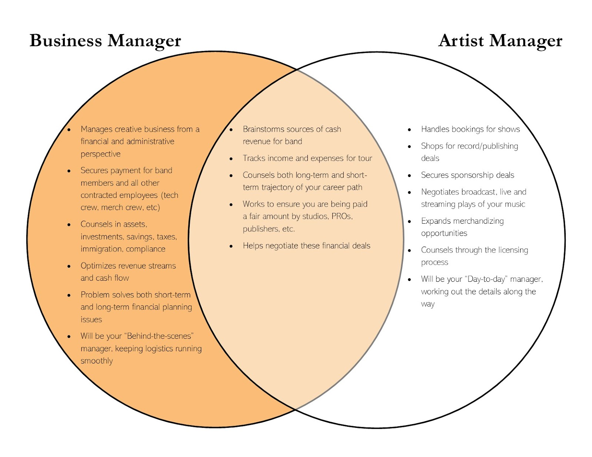

In [Part I of this series](/what-do-you-even-do/) **What do you even do?**, I gave you a broad look at the role of an entertainment business manager. In this post, I’m going to focus on a little compare/contrast between the entertainment business manager and other support staff along your journey.

I often have people ask about the difference between a business manager and an artist manager or bookkeeper. Though we all play an important and, in my honest opinion, indispensable role in the success of an artist, we each contribute something wholly different from the other.

**Business Manager vs. Artist Manager**

I want to begin by saying you likely need *both* a business manager and an artist manager. They each play an invaluable role in your ongoing growth and success, even if those roles are different. In fact, I know many artist managers who won’t work with an artist unless they also have a business manager.

So what’s the difference?

Generally, **artist managers** handle the big picture, working with you on the growth of your creative endeavors and accompanying business opportunities. **Business managers** typically handle the day-to-day income, expenses, and finances related to your growing business. There is crossover for conversation and brainstorming, but each has their unique area of expertise.

Here’s a way to think about it in “corporate terms”: you own your creative business, so you’re the **Owner/Founder**. The artist manager works as your **CEO /** **Chief Operating Officer**, locking down investors, partnerships, business opportunities (sponsorships, tours). Basically, the day-to-day strategies of how to make money doing what you do. The business manager, then, works as your **Chief Financial Officer**, executing the business plan to ensure ongoing long-term growth. The COO asks, How can we make more money and expand the platform? The CFO asks, What’s the best way to manage the money and details so you never stall?

Here’s another way to look at it: If your creative business was a car with you in the driver’s seat, the artist manager is the **spark plugs**. They create the explosions that bring the car to life and get things really moving. The business manager is like the **flywheel**, controlling the momentum of the car so it drives and shifts smoothly. Without a flywheel, the whole car will jerk and make uneven movements, until it overheats and seizes! So your artist manager can create business opportunities for you, but the business manager uses momentum to keep everything moving forward smoothly.

To get an idea of specifics, let’s look at that tried and true musician season: the tour. On tour, the artist manager focuses on increasing revenue and exposure. They work with your team to find venues, sponsors, accommodations, merch opportunities, radio play before you arrive, etc. But while you’re on tour, there is a lot of administrative work being done in the background that your artist manager won’t want to be distracted with. For them, life is on hold while the tour happens. But, life *is still happening* and someone’s got to think about it.

On tour, it’s your business manager who can help with some of the regular “adulting” that still needs to happen, like bank runs, ensuring all accounts are flowing as they should, managing payroll for your 1099 crew, etc. At BriBiz, we especially shine at the scrappy cash flow details that arise during tour and back at home. I’ve been there myself!

Broadly speaking, artist managers don’t always thrive on administrative work. The music business is one of the most complicated payment structures in the world. You need someone who knows the language, stays up-to-date, and specializes in music revenue administration. You can have countless streams of revenue with spreadsheets and statements galore–it’s too much for the artist manager to manage while *also* proactively thinking about how to keep that money flowing.

We’ve handled immigration issues and compliance issues, making sure everything is above board and that clients won’t be surprised by future legal troubles. And I’m not even getting into loans, mortgages, lines of credit, insurance, power of attorney, business licenses, and taxes–all the things an artist manager would rather not get involved in for obvious reasons.

Below you can see a broad overview of the differences and similarities between your business manager and your artist manager:

But now it’s important to note that not all administrative work is the same. Let’s look at how a business manager differs from a bookkeeper.

**Business Manager versus Bookkeeper**

While a bookkeeper and business manager both handle finances, their roles in relation to the finances are very different. A bookkeeper is almost entirely reactive, tracking and balancing transactions. You make your financial decisions–for good or bad–and they come along after the fact to record and settle accounts. While this is better than nothing, it doesn’t anticipate your needs nor does it set you up for ongoing success.

A business manager will help you catch everything that’s happened, assess everything that’s currently happening, and plan for everything that’s coming up. We make the financial and strategic timelines of your creative business smooth and cohesive. Instead of reactive, business managers are proactive, communicating with the client and staying ahead of the details.

If you just need help settling accounts and preparing for tax season, a bookkeeper could do the job. But they won’t make sure your plans for your creative business and choices align with your bigger vision. Only a business manager could do that.

Finally, your business manager is independent of both your artist manager and your bookkeeper. This means we can act as a neutral 3rd party when you hire or work with them. As your needs for your representation and management flux and grow, your business manager can make sure you never go through any changes or transitions alone.

Like it or not, your career is a business. Yes, you’re an artist, but you’re also a business owner and you deserve the support you need. Hiring a business manager may just be the thing you need to unlock momentum and get your business running smoothly.

What other questions can I answer for you about what an entertainment business manager does?
